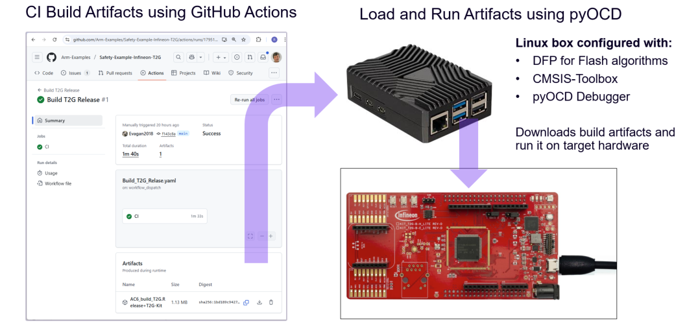

# Self-Hosted Runner for Execution Test

The CMSIS-Toolbox implements and [Run and Debug Configuration](https://open-cmsis-pack.github.io/cmsis-toolbox/build-overview/#run-and-debug-configuration) for command line usage with pyOCD. pyOCD is a debug connector used in [Keil Studio] that offers also command-line operation for Continuous Integration (CI).

This section explains how to setup a Linux box that runs a GitHub self-hosted runner for programming and execution of an application. The [build workflow](../.github/workflows/Build_T2G_Release.yaml) is executed on a GitHub hosted runner that stores the build output as an artifact.
The [run workflow](../.github/workflows/Run_T2G_Release.yaml) is executed on a self-hosted runner hosted on a Raspberry Pi.



## Setup of the Raspberry Pi hardware

The following parts are required for setting up the Raspberry Pi hardware:

- MicroSD card, 32GB or larger, Class 10 recommended
- MicroSD card reader (for flashing the OS)
- Power supply [official Raspberry Pi PSU recommended](https://www.raspberrypi.com/products/27w-power-supply/)
- Keyboard and mouse for the first setup
- Ethernet cable
- Optional: HDMI cable and monitor for the non-headles OS

## Setup of a Linux System

The following steps describes how to install an Ubuntu ARM OS on the Raspberry Pi 5

### Prepare the Operating System
- Download the **Raspberry Pi Imager** (official tool): Available for Windows, macOS, Ubuntu: https://www.raspberrypi.com/software/
- Connect the reader to your PC and insert the microSD card
- Launch the tool and do the following selections
  - Device: **Raspberry 5**
  - Operating System: Other general-purpose OS &rarr; Ubuntu &rarr; **Ubuntu Desktop 24.04.3 LTS (64-bit)**
  - Storage: Uncheck the box 'Exclude System Drivers' and select the: **Mass Storage Device**
- Press Next &rarr; Press Yes for the warning &rarr; Writting to the microSD card starts.

### Insert the microSD and Connect Peripherals
- Insert the repared microSD card into the Pi
- Connect: Keyboard, mouse, monitor, network cable, and finaly the power-supply

### First Boot & Configuration
- On first boot, the OS will:
  - Expand the file system automatically
  - Launch the setup wizard to configure: locale, time zone, keyboard layout, a.o.
- You’ll land on the desktop environment

### Update and Upgrade
Open a terminal and run:
```
     sudo apt update
     sudo apt full-upgrade -y
```
This ensures your Pi has the latest software and security updates.


### Optional configuration
To enable SSH, change the hostname, a.o.
```
     sudo raspi-config
```

### Remote Access
- Open a terminal from your pc and run:
```
     ssh pi@<raspberrypi_ip_address>
```
to test the headless controll of you Raspberry


### Install pyOCD

Install pyocd via ssh login to the Pi5
```
     $ pip3 install pyocd
```


## Setup Runner on Raspberry Pi5

You need a GitHub account with access to the repository/org where you want the runner.

Run these commands on the Raspberry Pi. They’ll look something like this:

ToDo 

```
     # Create a folder dedicated for your repository. i.e.
     $ mkdir runner-safety-ifx-t2g && cd runner-safety-ifx-t2g

     # Download the latest runner package
     $ curl -o actions-runner-linux-arm64-2.328.0.tar.gz -L https://github.com/actions/runner/releases/download/v2.328.0/actions-runner-linux-arm64-2.328.0.tar.gz


     # Optional: Validate the hash
     $ echo "b801b9809c4d9301932bccadf57ca13533073b2aa9fa9b8e625a8db905b5d8eb  actions-runner-linux-arm64-2.328.0.tar.gz" | shasum -a 256 -c

     # Extract the installer
     $ tar xzf ./actions-runner-linux-arm64-2.328.0.tar.gz
```

## Workflow

